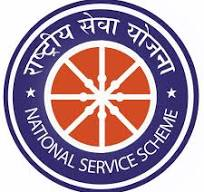

# Sarhad NSS — National Service Scheme

<p align="center">
  
</p>

<p align="center">
  Official website of the National Service Scheme (NSS) unit at Sarhad College of Arts, Commerce and Science, Katraj, Pune.
</p>

---

## ✨ Features

- **Responsive Design** — Works on desktop, tablet, and mobile devices
- **Modern UI** — Glassmorphism effects, smooth animations, clean typography
- **6 Pages** — Home, About Us, Activities, Contact, Register, Enrollment Form
- **Shared Components** — Consistent navigation and footer across all pages
- **Interactive Elements** — Animated counters, scroll-triggered animations, mobile menu
- **SEO Ready** — Meta descriptions and viewport settings included

---

## 📁 Project Structure

```
NSS-Website/
├── index.html          # Home page
├── aboutus.html        # About page
├── activities.html     # Activities & gallery
├── contactus.html      # Contact page
├── register.html       # Registration info
├── form.html           # Enrollment form
├── shared.css          # Global styles
├── shared.js           # JavaScript utilities
├── logos/              # Logo images
│   ├── nss.jpg
│   ├── clg.jpg
│   └── sppu.jpg
└── actvt.jpg           # Activity calendar image
```

---

## 🛠️ Tech Stack

- **HTML5** — Semantic markup
- **CSS3** — Custom properties, Flexbox, Grid, media queries
- **JavaScript** — Vanilla JS for interactions
- **Icons** — Font Awesome 6.6

---

## 🚀 Getting Started

1. **Clone the repository**
   ```bash
   git clone https://github.com/abhishek-balsure/NSS-Website.git
   ```

2. **Open in browser**
   - Simply open `index.html` in your browser
   - Or use a local server: `npx serve .`

---

## 📸 Preview

The site includes:
- Hero section with call-to-action
- Vision & Mission cards
- Stats counter (volunteers, activities, hours, lives impacted)
- Activity gallery
- Testimonials
- Registration form
- Contact information

---

## 📞 Contact

- **Address**: Sarhad College of Arts, Commerce & Science, Katraj, Pune-46
- **Email**: nssposarhad@gmail.com

---

## 📜 License

This project is for educational purposes.

---

<p align="center">Made with ❤️ by <a href="https://github.com/abhishek-balsure">Abhishek Balsure</a></p>